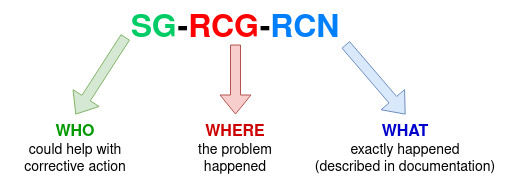

# README

## Synopsis

This Ansible Role ensures generation of standardized, structured results from execution of Ansible Playbooks ([Custom stats](https://docs.ansible.com/ansible/latest/collections/ansible/builtin/set_stats_module.html)). This result contains status information about success of execution even on detail of particular actions (if needed) with information what is the reason for potential unsuccessful execution. This result from execution is then processed and visualized by AIOPs Performance Dashboard for next investigations.

__Every asset that is using this role must first set [job_properties](#setting-job-properties).__ The only exception are Ansible Roles (reusable "libraries" called by another assets).

## Variables

### Job properties playbook variables

Variables used for setting [job properties](#setting-job-properties).

Parameter | Defaults | Comments
----------|-----------------|--------
__asset_name__ (String) | `N/A` | __Mandatory__. Used by AIOPs Performance Dashboard for unique identification of the asset.
__documentation__ (Dictionary) | `N/A` | __Mandatory__ Set of key:value pairs used by AIOPs Performance Dashboard for assingment documentation to specific action (defined by __action_name_level1__). Documentation for action `default` must be defined ( representing default documentation for all actions without explicit documentation). For more details read chapter [Setting job properties](#setting-job-properties) and Wiki page [good practice for job properties](https://github.kyndryl.net/Continuous-Engineering/ansible_role_returncode/wiki/Good-practices#good-practice-for-job-properties-playbook-variables-documentation)

### Variables for setting individual returncode

Parameter | Defaults | Comments
----------|-----------------|--------
__rc_success__ (Boolean) | false | __Optional__ Action performed successfully. If true, then Return Code is set to `0`. Overrides `rc_support`, `rc_group` and `rc_number`.
__rc_support__ (String) | developer | __Recommended__ to be set if not `rc_success`. (RCG) Code of team who could help with investigation and/or corrective action. Code describing who could help with corrective action. See [List of available options](#list-of-options-for-variable-rc_support). See [Good practices](https://github.kyndryl.net/Continuous-Engineering/ansible_role_returncode/wiki/Good-practices#good-practice-for-variable-rc_support) in WIKI for more details.
__rc_group__ (String) | framework | __Recommended__ to be set if not `rc_success`. Group (family) of return code. High level grouping of return codes. Family of return codes. Used for easy sort of the return codes by their type. See [List of available options](#list-of-options-for-variable-rc_group). See [Good practices](https://github.kyndryl.net/Continuous-Engineering/ansible_role_returncode/wiki/Good-practices#good-practice-for-variable-rc_group) in WIKI for more details.
__rc_number__ (String) | 999 | __Recommended__ to be set if not `rc_success`. Return code number unique for each situation. When not provided, default value `999` is used. Unique code specific for each error. Each return code number must be listed and explained in the asset documentation. See [Good practices](https://github.kyndryl.net/Continuous-Engineering/ansible_role_returncode/wiki/Good-practices#good-practice-for-variable-rc_number) in WIKI for more details.
__rc_message__ (String) | `N/A` | __Recommended__ to be set if not `rc_success`. Text with description of the problem. It should contain dynamically generated values, which exactly describe where the problem happened (filename, name of the process, …). See [Good practices](https://github.kyndryl.net/Continuous-Engineering/ansible_role_returncode/wiki/Good-practices#good-practice-for-variable-rc_message) in WIKI for more details.
__rc_host__ (String) | {{&nbsp;inventory_hostname&nbsp;}} | __Optional__ Can be used to change the reporting host (e.g. to `"localhost"`)
__rc_variables__ (Dictionary) | `N/A` | __Optional__ Dictionary that can replace variables `rc_support`, `rc_group`, `rc_number`, `rc_message` and `documentation`. See [Examples](#examples) for more details. It is important that the used dictionary variable name contains name of your asset to prevent collision with other asset variables (e.g. `uidext_return_codes`)
__action_name_level1__ (String) | `N/A` | Optional. Used for naming of 1st level of results. Should be used if there are performed __more "business" actions on one endpoint.__ See [Good practices](https://github.kyndryl.net/Continuous-Engineering/ansible_role_returncode/wiki/Good-practices#good-practice-for-variable-action_name_level1) in WIKI for more details.
__documentation__ (String) | `N/A` | Exceptional. Used for exceptional cases or building blocks only. Link to the documentation for one specific Return Code. Used only if the link to the documentation is different than the main documentation. <br/>__Main documentation has to be set by [Job properties](#job-properties-playbook-variables) and this setting is **MANDATORY**.__
__store_results_in_custom_stats__ | `true` | If set to `true`, returncode structure is stored in Custom stats and reported further. __Information once stored in Custom stats can't be then deleted.__ This variable should be used when you need specific handling of Return Codes generated by called Ansible Role. See Examples in TBD WIKI.

### Output variables

Variable | Choices/Defaults|Comments
----------|-----------------|--------
__returncode__ (String) | 2-2-999 (developer-framework-999) | Variable containing last generated returncode in standardized format.
__returncode_message__ (String) | `N/A` | Message part of the return code. Content of last __rc_message__.

### Variables reserved for exceptional usage

Parameter | Defaults | Comments
----------|-----------------|--------
__action_name_level2__ (String) | `N/A` | Optional. Used for naming of 2nd level of results. Designed for potential future cases when needed deeper granularity of results from execution. Not supported by AIOPs Performance Dashboard yet!.
__action_key_name__ (String) | action_rc | Optional. Used for inserting additional data into Custom stats. __Do not change for standard returncode usage.__
__result_action_value__ (String) | `Generated returncode` | Optional. Used for inserting additional data for Custom stats. __Do not change for standard returncode usage.__

## Results from execution

This role is designed to propagate results of playbooks that links it. Therefore results of this role should correspond with the results of the linking playbook. However if the results of some play are missing, then artificial results are generated by external tools that process the results before displaying them in Dashboard. More details about this (artificial Return Codes -1, -2, -3, ...) can be found [here](https://github.kyndryl.net/Continuous-Engineering/ansible_role_returncode/wiki/Reporting-For-No-ReturnCodes-Generated)

## Procedure

This Ansible Role will ensure generation of formated results from Ansible Playbooks execution via ([Custom stats](https://docs.ansible.com/ansible/latest/collections/ansible/builtin/set_stats_module.html)). Results are formated following way:

### Job properties section

It contains name of the asset (`asset_name`) and links to the documentation related to the particular actions which are performed by the playbook. This documentation must describe meaning of the used Return codes.

See [Job properties variables](#job-properties-playbook-variables).

```json
"job_properties": {
  "asset_name": "UID extraction",
    "documentation": {
      "default": "https://github.kyndryl.net/Continuous-Engineering/ansible_collection_uidextraction",
      "DB2 UID extraction": "https://github.kyndryl.net/Continuous-Engineering/ansible_role_uidextractor_db2",
      "UNIX OS UID extraction": "https://github.kyndryl.net/Continuous-Engineering/ansible_role_uidextractor_unix"
  }
}
```

#### Job results section

It contains Generated Return Codes from executions of the playbook for each particular action on each server in the scope of the Job Template.

The field `action_rc` is defined by variable `rc_success` or it contains structured value from `rc_support`, `rc_group`, `rc_number` (see [Return Code structure](#return-code-structure) bellow).

The field `message` is defined by variable `rc_message`.

Names of actions (`UNIX OS UID extraction`, `DB2 UID extractionl` in the example) are defined by variable `action_name_level1`. If this variable is not set then action has name `generic`.

```json
"job_results": {
    "ipcmon01.kyndryl.com": {
      "UNIX OS UID extraction": {
        "message": "Error due to...",
        "action_rc": "1-4-123"
      },
      "DB2 UID extractionl": {
        "action_rc": "0"
      }
    },
    "ipcmon02.kyndryl.com": {
      "generic": {
        "message": "Failed prerequisites of endpoint",
        "action_rc": "1-4-123"
      }
    }
}
```

#### Return Code structure



Return Code itself describes

- __WHAT__ exactly went wrong (__RCN__ - Return Code Number) - Specific for each asset and each RCG and should be described in detail in the asset documentation, including what corrective actions should be performed
- __WHERE__ the problem occured (__RCG__ - Return Code Group) - Group of return codes describing in high level families of problems
- __WHO__ could help with corrective action (__SG__ - Support Group) - Who could help with detailed investigations what went wrong and perform corrective actions or coordinate specialists for specific problems.

This role "translates" the problem described by developer into a standardized String, that can be passed to a following tools (like Digital Experience Dashboard), where it is presented in human readable form.

### List of options for variable `rc_support`

Code describing who could help with corrective action.

__Default codes__
 Input code | generated code | Explanation
------|-------------------|------------
__success__ | 0 | Same as setting `rc_success: true`. If `rc_support` is set to `success` then other inputs are ignored and returncode is set to `0`
__account__ | 1 | Action needed to be done by account (Account Tower Admin, OS/middleware Admin, Account GitHub Admin, Account SME/DPE ...)
__developer__ | 2 | Probably unexpected error or problem in the code of the asset which should be investigated by developer of the asset.
__undetermined__ | 3 | Undetermined or combination of teams. Used when it is not clear who should take action.

### List of options for variable `rc_group`

 Input code | generated code | Explanation
------|-------------------|------------
__connection_issue__ | 1 | Connectivity problems.
__framework_playbook__ | 2 | Problems with main playbook (role/collection/...). This is usually the playbook that is executed directly by Ansible or Tower Job Template or problem with it's own closely binded components (Ansible Roles/Collections/Modules/Plugins).
__component_playbook__ | 3 | Problem with invoked or linked playbook/role/collection. This is usually some subcomponent that is used by the framework playbook and may be for example stored in different repository. This can be also external asset used by the framework's playbook.
__misconfiguration__ | 4 | Incorrect input parameter (Incorrect/corrupted format, invalid/out of scope values, ...) For example missing value in mandatory variable, incorrect credentials, string value in list variable, etc.
__service_issue__ | 5 | Problem with external service (SFS, BDS, Tower API, 3scale API, ...)
__unsupported_platform__ | 6 | Unsupported platform (Execution on unsupported OS/subsystem or version)
__prerequisite__ | 7 | Prerequisite was not met (Required package is not installed, required module is missing...)
__process_incomplete__ | 8 | Execution was interrupted or paused by external framework (Execution paused and waiting for approval)

## Support

- Please submit new issues in this repository.
- We follow [CE Governance model](https://github.kyndryl.net/Continuous-Engineering/CE-Documentation/blob/master/files/GOVERNANCE.md)
- Main developer is [Richard Vanek](mailto:richard.vanek@kyndryl.com)
- Asset is in stable state. Next development is planned to be done in building blocks common collection.

## Deployment

Deploy into your asset as any standard role by adding to the `requirements.yml` file. You can link specific release or versioned branch which will give you automatic update of bugfixes. Example:

```yaml
- name: returncode
  src: git+https://github.kyndryl.net/Continuous-Engineering/ansible_role_returncode.git
  version: 1.3/main
```

## Known problems and limitations

### Rewriting error by success

If error is reported and later re-written by a success then the key `message` from original Error is not removed.
It is due to the fact that information once stored in Custom stats can't be deleted.

Example:

```yaml
- name: Generate RC
  include_role:
    name: returncode
  vars:
    rc_support: account
    rc_group: misconfiguration
    rc_number: 1
    rc_message: "Error text"

# Report successfull
- name: Generate RC
  include_role:
    name: returncode
  vars:
    rc_success: true
```

will result in:

```json
{
  "job_results": {
    "mytestserver.kyndryl.com": {
      "generic": {
        "action_rc": "0",
        "message": "Error text"  
      }
    }
  }
}
```

### Display Custom stats

Custom stats should be visible at the end of the Job log. If not then Tower admins has to set environment variable `ANSIBLE_SHOW_CUSTOM_STATS = yes` in the Tower configuration. As workaround in the case when Tower admins are not able to set the environment variable, it can be set by creating `ansible.cfg` file in the root of the Project with following content:

```yaml
[defaults]
show_custom_stats=true
```

## Prerequisites

- [Standard ansible prerequisites](https://kyndryl.sharepoint.com/sites/CACF/SitePages/Engagement/managed-endpoints.aspx)
- This Ansible Role must be linked from `requirements.yml`

## Examples

For more examples and good practices please visit [WIKI](https://github.kyndryl.net/Continuous-Engineering/ansible_role_returncode/wiki).

### Basic Principle of error handling and Return Code generation

```yaml
tasks:
- name: ATTEMPT TO COPY FILE
  block:
    - name: "Print a message - Task 1"
      ansible.builtin.debug:
        msg: 'I execute normally'

    # This action could fail
    - name: "Copy file - Task 2"
      win_copy:
        src: "files/testfile.txt"
        dest: "C:/tmp"
      register: copy_result

  rescue:
    - name: RETURN CODE GENERATION IN CASE OF FILE COPY FAILURE
      include_role:
        name: returncode
      vars:
        rc_support: developer
        rc_group: component_playbook
        rc_number: 111
        rc_message: "Error of copying file: {{ copy_result.stderr }}"
```

README of the asset must contain description of Return Code 111 (in Chapter "Results from execution") and recomendation what should be corrective action for elimination of failure represeted by this Return Code.

### Template for a simple playbook with Return Code generation

```yaml
---
- hosts: all
  tasks:
    - name: Set link to documentation and name of this tool
      include_role:
        name: returncode
        tasks_from: set_job_properties
      vars:
        asset_name: "My new tool"
        documentation:
          default: "https://github.kyndryl.net/Continuous-Engineering/ansible_collection_my_new_tool"

    - name: Doing some stuff that can fail
      block:
        - debug:
            msg: "Hello world."

        - name: Report success
          include_role:
            name: returncode
          vars:
            rc_success: true
      rescue:
        - name: Something in block failed. Generate error.
          include_role:
            name: returncode
          vars:
            rc_support: developer
            rc_group: framework_playbook
            rc_number: 1111
            rc_message: "Failed when printing 'Hello world' text."
```

#### Setting job properties

Don't forget set job properties at the beginning of your playbook. Set name of your asset and link to the documentation (README).  README of the asset must contain description of all Return Codes and recomendation what should be corrective actions for elimination of failures represeted by each Return Code.

AIOPs Performance Dashboard is using this information for showing correct link to documentation for given Return Code.

```yaml
- name: Set job properties
  include_role:
    name: returncode
    tasks_from: set_job_properties
  vars:
    asset_name: "UID extraction"
    documentation:
      default: "https://github.kyndryl.net/Continuous-Engineering/ansible_collection_uidextraction"
```

### Generation Return Codes in Playbook with one action

```yaml
# Generate RC about incorrect configuration that should be solved by Tower Job template admin with number `6001`
- name: Generate RC
  include_role:
    name: returncode
  vars:
    rc_support: account
    rc_group: misconfiguration
    rc_number: 6001
    rc_message: "Incorrect value {{ time_stamp | default('undefined') }} in the variable `time_stamp`. Expected format is `HH:MM`."

# Report successfull execution (asset performed action as designed)
- name: Generate RC
  include_role:
    name: returncode
  vars:
    rc_success: true

# Print returncode
- name: Print RC
  debug:
    var: returncode

# Use dictionary to set RC variables - Predefining the errors.
# Content of /vars/main.yml file:
myrole_return_codes:
  my_error_nr1:
    rc_support: account
    rc_group: misconfiguration
    rc_number: 101
    rc_message: "Error situation number 1 happened. Please fix it."
  another_error:
    rc_support: account
    rc_group: misconfiguration
    rc_number: 102
    rc_message: "Another problem happened. Please fix it."
# Content of playbook:
- name: Generate RC
  include_role:
    name: returncode
  vars:
    rc_variables: "{{ myrole_return_codes['my_error_nr1'] }}"
```

Generated fragment of Response from execution in Custom Stats - when incorrect configuration happened

```json
{
  "job_results": {
    "myserver.kyndryl.com": {
      "generic": {
        "action_rc": "1-4-6001",
        "message": "Incorrect value `12AM` in the variable `time_stamp`. Expected format is `HH:MM`."
      }
    }
  }
}
```

### Generation Return Codes in Playbook with multiple actions

You may need to report results from more actions individually. It is usefull in cases when even partial success of job execution is beneficial but you need to see which actions weren't successfull and why.

If particular actions are performed by individual assets (Ansible Roles/Collections) with own documentation then you need to assign the name of the action (defined by variable `action_name_level1`) to appropriate asset's documentation by setting the Job properties. It is important because user of the asset must be able to see which documentation describes meaning of each generated Return Code.

It is defined by job properties at the beginning of the playbook.

Example for actions `DB2 UID extraction` and `UNIX OS UID extraction`. For all other actions will be used `default` documentation.

Fragment of Playbook code for job properties setting:

```yaml
- name: Set job properties
  include_role:
    name: returncode
    tasks_from: set_job_properties
  vars:
    asset_name: "UID extraction"
    documentation:
      default: "https://github.kyndryl.net/Continuous-Engineering/ansible_collection_uidextraction"
      DB2 UID extraction: "https://github.kyndryl.net/Continuous-Engineering/ansible_role_uidextractor_db2"
      UNIX OS UID extraction: "https://github.kyndryl.net/Continuous-Engineering/ansible_role_uidextractor_unix"
```

Fragment of Playbook code for differentiation of Return Codes for different actions:

```yaml
- name: Generate RC for My action
  include_role:
    name: returncode
  vars:
    action_name_level1: "Unix OS UID extraction" # Must correspond with the value used in `documentation` section of setting job properties
    rc_support: developer
    rc_group: framework_playbook
    rc_number: 2222  # Meaning of the Return Code is described in README for UNIX OS extractor
    rc_message: "Failure of..."

- name: Generate RC for My another action
  include_role:
    name: returncode
  vars:
    action_name_level1: "DB2 UID extraction"
    rc_support: account
    rc_group: misconfiguration
    rc_number: 3333  # Meaning of the Return Code is described in README for DB2 extractor
    rc_message: "Failure of..."
```

#### Returncode reporting with custom documentation

In special cases, like writing a playbook that is not supposed to be executed by it's own but shall be used by other assets (like Building block) you may want to add a link to documentation of your Returncode for each action, because the structure of Custom stats data will be not under your control. In that case __do not set job properties__ in your playbook but add the documentation with usage of the variable `documentation`:

Example of Playbook code:

```yaml
- name: Generate RC
  include_role:
    name: returncode
  vars:
    rc_support: developer
    rc_group: component_playbook
    rc_number: 1111
    rc_message: "Failure of building block ABC due to...."
    documentation: "https://www.link-to-documentation-of-this-rc"
```

Generated result from execution

```json
{
  "job_results": {
    "myserver.kyndryl.com": {
      "action_rc": "2-3-1111",
      "message": "Failure of building block ABC due to....",
      "documentation": "https://www.link-to-documentation-of-this-rc"
    }
  }
}
```

#### Returncode reported for different host

In special cases you may want to set returncode for different host than is the current `inventory_hostname`. For example you are executing tasks on localhost and you want to set returncode for some specific host. Or you are executing tasks on some remote host but you want to set returncode for localhost. For this case you should use input variable `rc_host`

Example of Playbook code:

```yaml
- name: Generate RC
  include_role:
    name: returncode
  vars:
    rc_support: developer
    rc_group: component_playbook
    rc_number: 1111
    rc_message: "Failure of task ABC on localhost due to...."
    rc_host: "localhost"
```

Generated result from execution

```json
{
  "job_results": {
    "localhost": {
      "action_rc": "2-3-1111",
      "message": "Failure of task ABC on localhost due to....",
    }
  }
}
```

## License

[Kyndryl Intellectual Property](https://github.kyndryl.net/Continuous-Engineering/CE-Documentation/blob/master/files/LICENSE.md)
